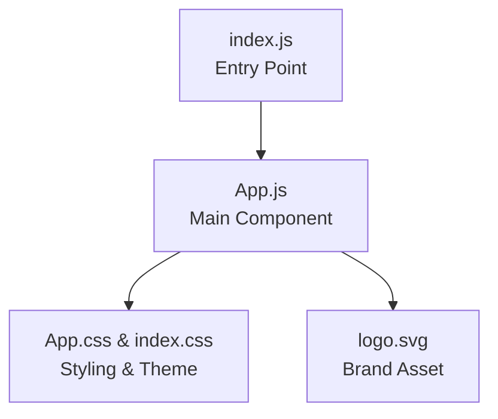

# To-Do List Application: Project Overview

## Purpose

The To-Do List application is designed as a simple, modern, and responsive tool that allows users to efficiently manage their daily tasks. Its intent is to offer an intuitive interface for adding new tasks, marking them as completed, deleting unwanted ones, and viewing the entire list of pending or finished items—all within a minimalistic, distraction-free web experience.

## Main Features

- **Add Tasks:** Users can create new tasks using a straightforward input form.
- **Mark as Completed:** Each task can be checked off once finished.
- **Delete Tasks:** Unwanted or obsolete tasks can be removed from the list.
- **View Tasks:** The application always displays an up-to-date list of tasks.
- **Theme Support:** A toggle between light and dark themes supports user preferences and comfort.

## High-Level Architecture Overview

The To-Do List application is structured as a single frontend container built using React, with a foundation for extensibility to include future backend or API integrations.

### Container Overview

- **Frontend Container:**  
  - **Path:** `/to_do_frontend`
  - **Type:** Web (React SPA)
  - **Responsibility:** Provides all UI components, manages local state, and renders all user interface logic for managing tasks.
  - **Current Interfaces:** Does not communicate with external APIs in this minimal version, but is architected for easy extension to backend services (via HTTP requests, for example).

#### Main Files Structure

- `src/index.js` — Application entry point, bootstrapping the React app.
- `src/App.js` — Main React component; manages UI logic, theme toggling, and hooks up global styles.
- `src/App.css` — Defines modular, theme-aware CSS for the entire UI.
- `src/index.css` — Global CSS resets and typography.
- `public/index.html` — HTML shell (in a real-world Create React App setup, present in the public folder).

### Component/Data Flow



#### Example Workflow

1. User navigates to the homepage.
2. `index.js` renders the `App` component.
3. The UI presents a task input bar and a list of tasks.
4. The theme can be toggled at any time via a user control.
5. On adding, toggling, or deleting tasks, the UI updates instantly.

## Technology Stack

- **Framework:** React 18 (Functional Components, Hooks)
- **Styling:** Vanilla CSS (no heavy UI libraries; leverages CSS Variables for theming)
- **Tooling:** Create React App (via react-scripts)
- **Javascript Standard:** Latest ECMAScript, Linting enabled (ESLint)
- **Node Modules:** Only minimal dependencies: `react`, `react-dom`, `react-scripts`, and some dev tools like `cross-env`

## Installation & Usage

### Prerequisites

- Node.js (v16 or newer recommended)
- npm (comes with Node.js)

### Getting Started

1. **Install dependencies:**
   ```sh
   npm install
   ```
2. **Run the development server:**
   ```sh
   npm start
   ```
   Open [http://localhost:3000](http://localhost:3000) to view in your browser.

3. **Run tests:**
   ```sh
   npm test
   ```

4. **Build for production:**
   ```sh
   npm run build
   ```

This will output static files into the `build/` directory.

### Customization

- **Theming:**  
  Edit CSS variables in `src/App.css` under `:root` and `[data-theme="dark"]` to change brand colors or theme palettes.

- **Extending Functionality:**  
  Add more React components in `src/` (e.g., for tasks, API interactions, authentication) and wire them into `App.js`.

## Further Resources

- To extend this app with backend APIs (for persistent storage or multi-user features), connect the frontend to a RESTful API or a BaaS (Backend as a Service).
- For deeper React knowledge, visit the [React documentation](https://reactjs.org/).

---

This documentation provides a high-level reference for new contributors and stakeholders wishing to understand, run, or extend the To-Do List application's core frontend.
