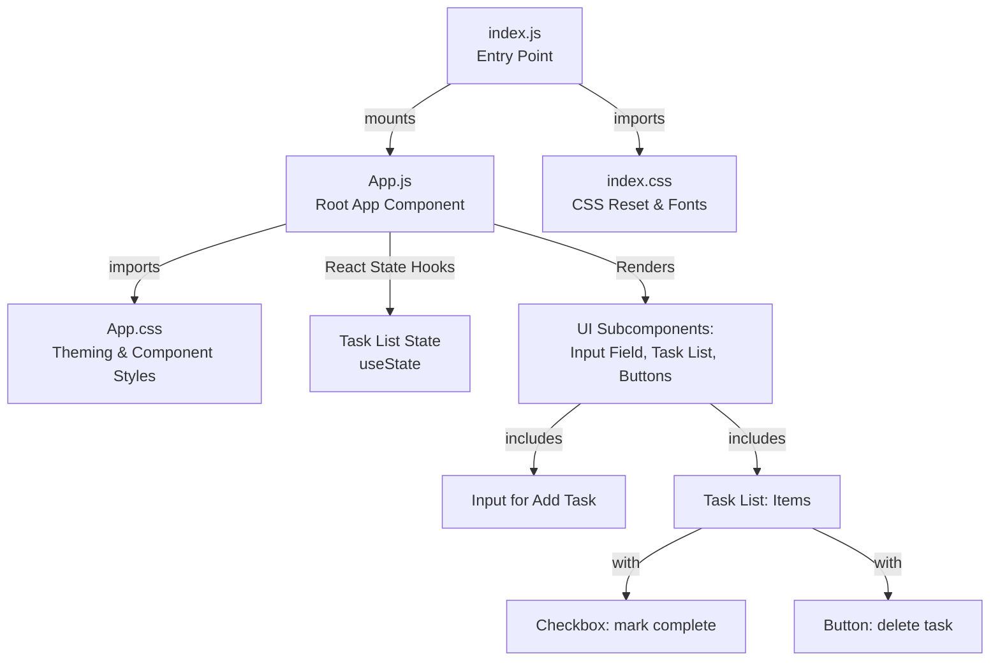

# To-Do Frontend Architecture Documentation

## Overview

The `to_do_frontend` is a lightweight React single-page application (SPA) that provides an interactive user interface for a classic To-Do List. The architectural approach favors a clear, single-root component design with an emphasis on simplicity, minimal dependencies, ease of customization, and maintainability. All core features—adding tasks, marking as completed, and deleting tasks—are implemented in the main component using functional React paradigms.

---

## Architectural Structure

The project is organized as follows:

```
to_do_frontend/
│
├── src/
│   ├── index.js        # App entry point - mounts <App /> and imports global CSS
│   ├── App.js          # Main React component - includes all UI and logic for tasks
│   ├── App.css         # Main CSS with brand variables, theming, component styles
│   └── index.css       # Global CSS reset, font definitions
└── kavia-docs/
    └── architecture.md # (this document)
```

---

## Component and Data Flow

The application's flow is centered on two core files:

- **index.js:** Entry file that mounts the main `<App />` component into the root DOM element, importing base CSS styles.
- **App.js:** Functional React component defining all state management, task operations, UI rendering, and theming. Uses React hooks (`useState`) for local state.

### Main UI/Logic:

- **Add Task:** Input field at the top allows users to enter new tasks. Submitting the form appends a task to the array in component state.
- **View/Delete/Complete Tasks:** List displays all tasks, each with a checkbox (complete/incomplete) and delete button.
- **State-driven UI:** All interactions use immutable updates to local state; the UI always reflects the current state of the task array.

### Styling:

- **App.css:** Defines theme colors using CSS Variables, with unique variables for light and dark modes to allow easy restyling or extension. Styles specialized CSS classes for core elements (container, form, list, items, buttons).
- **index.css:** Contains global resets and typography/spacing defaults for consistency across browsers and devices.

---

## Mermaid Diagram

Below is the architectural diagram for the to-do frontend application, capturing high-level component relations and main responsibilities:



---

## Styling, Theming, and Layout

- **Brand Colors:** Defined in `App.js` and CSS variables for easy re-theming. Minimal inline styling for primary actions.
- **Minimal, Responsive UI:** Layout adapts to mobile, with input and controls easy to access on all screen sizes.
- **No External UI Libraries:** Only React and vanilla CSS used, maximizing understandability for contributors.

---

## Extensibility

The main component structure and state logic are built for clear expansion:
- To add new features, developers can break out portions (form, list, task item) into smaller React components.
- Future backend/API integration can be layered in by swapping or augmenting local state management and adding async actions.
- Theming can be further customized at scale via CSS variables.
- The codebase is suitable for onboarding new contributors (single-point entry, single-state owner, minimal indirection).

---

## Technology Stack

- **Framework:** React 18+ (Functional Components + Hooks)
- **Styling:** Vanilla CSS using variables and selectors
- **Tooling:** Create React App, ESLint, minimal dev dependencies
- **No external state management, routing, or styling libraries**

---

This architectural documentation is intended to quickly orient new developers and maintainers to the structure, philosophy, and expansion points of the to-do frontend codebase.
