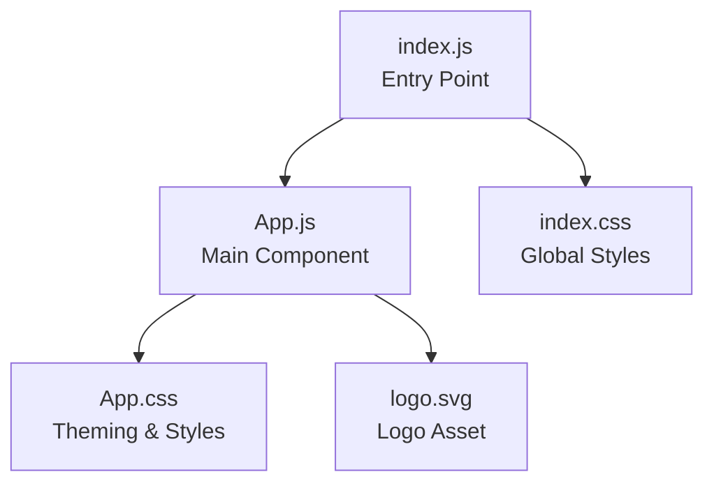

# To-Do Frontend Architecture Documentation

## Overview

The `to_do_frontend` is a lightweight React single-page application (SPA) designed to provide the user interface for a To-Do List application. It features a clean, minimal, and modern UI with built-in support for theme toggling (light/dark mode). The architecture prioritizes simplicity, easy maintainability, and performance through minimal dependencies and usage of vanilla CSS for styling.

## High-Level Structure

- **Entry Point:** `src/index.js`
  - This file acts as the application’s bootstrapper. It renders the React `<App />` component into the DOM using React 18’s root API (`ReactDOM.createRoot`). The rendering is wrapped in `React.StrictMode` to help highlight potential problems.

- **Main Component:** `src/App.js`
  - The core of the UI is encapsulated in the `App` functional component. It manages the theme (light/dark) state using React hooks (`useState`, `useEffect`) and renders:
    - A toggle button for theme switching.
    - Branding/logo.
    - Informational and instructional text elements.
    - A link to React documentation.
  - Styles are imported from `App.css`, and the KAVIA logo is displayed.

- **Styling:**
    - `src/App.css` manages the visual style and theme using CSS variables. It provides light/dark theme color schemes, UI layout styles, and responsive design for mobile.
    - `src/index.css` sets the foundational typography and resets default browser styles.

- **Dependencies:** 
  - The application is built on `react`, `react-dom`, and `react-scripts`. There are no external UI libraries or CSS frameworks, resulting in a very lightweight frontend.

- **Theming:**
  - CSS variables (custom properties) are defined in `App.css` for both light and dark themes. The root HTML element’s `data-theme` attribute is toggled by the React component, enabling dynamic theme switching.

## Component Flow

1. **Initialization (`src/index.js`):**
   - Locate the DOM node with id `root`.
   - Render `<App />` into this root.

2. **Application Layer (`src/App.js`):**
   - On load, sets the document theme based on user state.
   - Provides a theme toggle button for user interaction.
   - Renders all visible UI elements.

3. **Style Application:**
   - Global styles in `index.css`.
   - Main component and theme styles in `App.css` via imported CSS classes.

## Mermaid Diagram

Below is a high-level diagram describing the application’s major files and their relationships.

## Detailed Descriptions

### index.js

- Responsible for bootstrapping the React application and ensuring the root element in the HTML is used to display the app. 
- Only imports foundational dependencies and the main `App` component.

### App.js

- Holds the main UI logic and user interactions.
- Manages `theme` in state and uses `useEffect` to update the global document on state change.
- Renders the theme toggle control, branding, and informational content.

### Styling

- **App.css**: Defines theme color variables and switches between light/dark by setting `[data-theme="dark"]` on the document. Includes layout and responsive/mobile rules for core elements.
- **index.css**: Applies base font, removes default margins, and sets code font.

## Extensibility

- Designed for easy enhancement. For instance, adding additional components for tasks and their management can be done by adding more components within `src/`, importing them into `App.js`, and updating the rendering logic.

## Dependencies

- Core: `react`, `react-dom`, `react-scripts`
- Dev: `cross-env`
- No external UI libraries, leveraging browser standards and modern CSS.

---

This document provides a technical starting point for contributors or maintainers who want to understand or extend the To-Do List frontend’s architecture.

