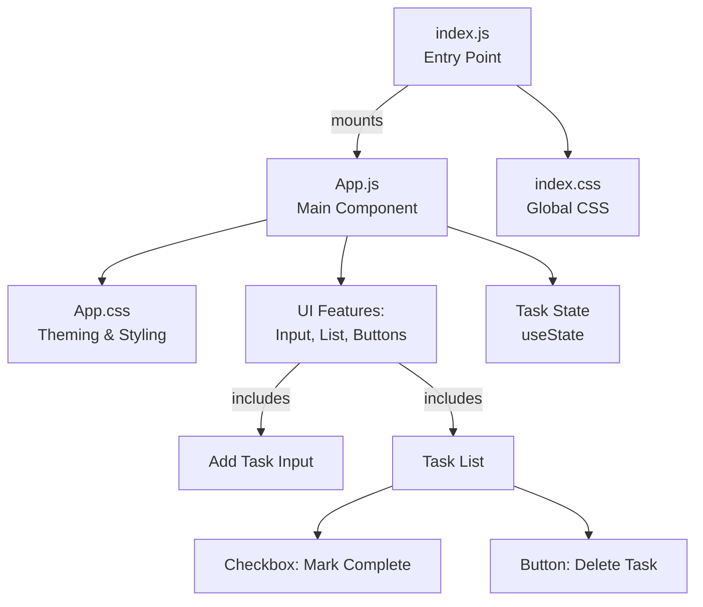

# To-Do Frontend Project Documentation

## Table of Contents

- [1. Architectural Requirements](#1-architectural-requirements)
- [2. Product Requirements](#2-product-requirements)
- [3. Test Coverage](#3-test-coverage)
- [4. Code Quality](#4-code-quality)
- [5. Security](#5-security)
- [6. Compliance](#6-compliance)

---

## 1. Architectural Requirements

### Overview

The `to_do_frontend` container is a minimal, single-page web application built using React 18+. Its architecture is centered around simplicity, maintainability, and extensibility. The project consists of a root React component and a clear, intuitive layout, exclusively utilizing vanilla CSS for styling. State management is achieved with React Hooks (`useState`). All user interactions—adding, toggling, and deleting tasks—are implemented within the main component for both clarity and ease of onboarding.

### Technology Stack

- **Framework:** React 18+ (Functional Components, Hooks)
- **Styling:** Vanilla CSS using CSS variables for theming (light/dark support)
- **Build Tool:** Create React App (react-scripts set-up)
- **Tooling:** ESLint for linting and code standards
- **Testing:** Jest and React Testing Library
- **Dependencies:** Only `react`, `react-dom`, and essential development dependencies (e.g., `cross-env`).

### Structure

```
to_do_frontend/
│
├── src/
│   ├── index.js        # Entry point, mounts App, imports global styles
│   ├── App.js          # Main component; all UI, state, logic
│   ├── App.css         # Theming, layout and responsive design
│   └── index.css       # CSS reset and base typography
└── kavia-docs/
    └── project-documentation.md # (this document)
```

### Component & Data Flow

The application follows a straightforward component and data flow:
- `src/index.js` mounts the main `<App />` component at the DOM root.
- `App.js` provides all logic and user interface for managing tasks.
- State (task list) and user input is managed via hooks (no external state manager).
- Tasks are added via a single input, displayed in a list with visual cues for completion or deletion.

#### Architectural Diagram



### Extensibility
- Additional React components can be introduced under `src/` for new features or to further modularize the UI.
- Theme or layout extension is easily accomplished by modifying CSS variables in `App.css`.
- Backend/API integration can be added by replacing or augmenting the local state with network requests.

---

## 2. Product Requirements

### User Stories & Features

- **Task Management:** Users can add, view, complete, and delete tasks.
- **Real-Time Updates:** All task changes are immediately reflected in the UI.
- **Minimal Dependencies:** The project runs with minimal Node modules for fast startup and performance.
- **Modern Design:** Clean, modern, responsive design, leveraging the KAVIA brand and CSS variables.
- **Accessibility:** Uses labels and focus cues for input fields and buttons.
- **Theming:** Designed for expansion to light and dark themes using CSS variables.

### Functional Requirements

- Add new tasks via a text input (max 80 chars).
- Mark tasks as completed with a checkbox.
- Delete tasks with a button.
- See the count of incomplete tasks at the bottom.
- Responsive so that the app is usable on mobile and desktop.

---

## 3. Test Coverage

### Overview

Automated tests reside in `src/App.test.js` and leverage React Testing Library. Test cases should include:

- Rendering the application.
- Adding a task and verifying it appears in the UI.
- Checking off a task and verifying completed status.
- Deleting a task and confirming its removal.

_Note: Current example test (`renders learn react link`) is present but doesn't reflect main functionality. Additional tests are advised for real-world deployment._

### Manual Testing

- Tasks flow works from any browser.
- Layout is responsive and UI remains functional at different viewport sizes.
- Keyboard navigation to input and buttons.
- Manual toggling between completed and uncompleted tasks.

#### Test Coverage Table

| Feature             | Automated Test | Manual Test |
|---------------------|:-------------:|:-----------:|
| Add Task            | Planned       | Yes         |
| Delete Task         | Planned       | Yes         |
| Mark Complete       | Planned       | Yes         |
| Counter/Status      | Planned       | Yes         |
| Responsive Layout   | No            | Yes         |

---

## 4. Code Quality

### Practices

- **Linting:** Enforced with ESLint using `eslint.config.mjs` tailored for React and JS best practices.
- **Readability:** Clear, descriptive naming and inline comments in main files (`App.js`).
- **No Unused Code:** Minimal sample/template code; unnecessary boilerplate removed.
- **Immutability:** State handled immutably with React best practices.
- **Maintainability:** Highly modular via single-responsibility main component; easy to refactor for larger scale needs.

### Tooling

- ESLint validates code on each save (see npm scripts in `package.json`).
- Latest ECMAScript features supported.
- Test skeleton provided.

---

## 5. Security

### Review of Implementation

- **No Direct API Usage:** All logic is client-side/local with no user data transmitted externally.
- **No Dependencies on User-Submitted Scripts:** Task input is plain text (no HTML injection).
- **No Authentication:** This version does not include logins or roles, thus there are minimal attack vectors.
- **Package Vulnerabilities:** Minimal dependencies, each from reputable sources (`react`, `react-dom`, `react-scripts`, `cross-env`).

### Best Practices

- All dependencies should be kept up-to-date to avoid vulnerabilities.
- When integrating APIs or external storage, employ HTTPS, sanitize outputs, and consider cross-origin controls (CORS).

---

## 6. Compliance

### General Principles

- **Licensing:** All dependencies (including React) use permissive, OSI-approved licenses.
- **Accessibility:** Makes use of ARIA labels on interactive elements and keyboard navigability.
- **Privacy:** No user or PII data is collected, stored, or transmitted.
- **GDPR/CCPA:** Not applicable to this frontend as no personal/user data is maintained or transmitted.

---

_This documentation is intended to serve as a baseline for current and future developers, reviewers, and stakeholders seeking a comprehensive, accurate, and up-to-date overview of the to_do_frontend React application's structure, capabilities, and assurance posture._
